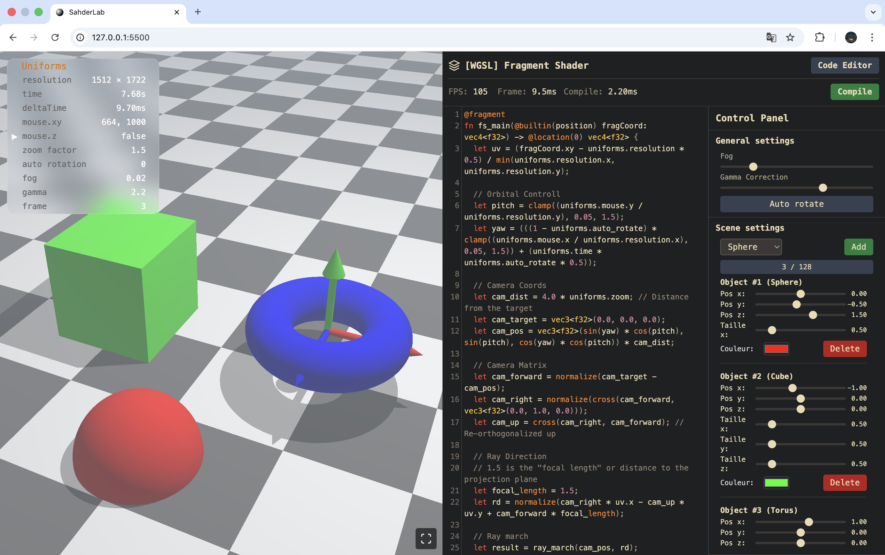

# ShaderLab: Interactive WebGPU Ray Marching Scene Editor 🚀



## Live Demo

Check out the live version deployed on Vercel: [ShaderLab Live](https://webgpu-shaderlab.vercel.app)

## Overview

ShaderLab is an interactive 3D scene editor built with WebGPU. Users can create and modify 3D primitives in real-time through an intuitive UI panel, with all changes instantly reflected in the ray-marched viewport.

## Features

- Real-time shader-based rendering of 3D primitives
- Interactive scene editor UI with sliders and color pickers
- Support for multiple primitive types (spheres, boxes, etc.)
- Dynamic addition and selection of objects
- Live updates to the scene without re-compiling shaders
- Object count limiter to maintain GPU performance

> [!NOTE]
> 3D gizmo interaction is planned as a feature and is not implemented yet.

## Tech Stack

- **WebGPU** for GPU-accelerated rendering
- **WGSL** (WebGPU Shading Language) for ray marching shaders
- **JavaScript** for UI and buffer management
- **HTML & CSS** for interactive panel and layout

## Local Development

### Prerequisites

- A modern browser with **WebGPU** support (e.g., Chrome Canary)
- Python 3 installed for a local server (or any other local server provider)

### Setup

1. Clone the repository:
   ```bash
   git clone https://github.com/yourusername/shaderlab.git
   cd shaderlab
   ```
2. Start a local server (example if you're using python for your local server):
   ```bash
   python -m http.server
   ```
3. Open your browser and navigate to `http://localhost:8000`

## Contributing

Contributions and suggestions are welcome! Feel free to open issues or submit pull requests for new features like the planned 3D gizmo.

## License

This project is licensed under the [MIT License](LICENSE).
